```mermaid
graph TD
    API[API Base: /api] --> Auth[Auth Routes]
    API --> Users[Users Routes]
    API --> Videos[Videos Routes]

    %% Auth Routes
    Auth --> Login[POST /auth/login]
    Login --> LoginBody[Body: Username, Password]
    Login --> LoginAuth[No Auth Required]

    %% Users Routes
    Users --> GetUsers[GET /users]
    Users --> CreateUser[POST /users]
    Users --> UpdateUser[PUT /users/:user_id]
    Users --> DeleteUser[DELETE /users/:user_id]
    Users --> GetUser[GET /users/:user_id]
    Users --> GetMe[GET /users/me]
    Users --> GetUserVideos[GET /users/:user_id/videos]

    GetUsers --> GetUsersAuth[Requires JWT + Admin]
    CreateUser --> CreateUserAuth[Requires JWT + Admin]
    UpdateUser --> UpdateUserAuth[Requires JWT + Admin]
    DeleteUser --> DeleteUserAuth[Requires JWT + Admin]
    GetUser --> GetUserAuth[Requires JWT + Admin]
    GetMe --> GetMeAuth[Requires JWT]
    GetUserVideos --> GetUserVideosAuth[Requires JWT + Admin]

    %% Videos Routes
    Videos --> GetVideos[GET /videos]
    Videos --> DeleteVideo[DELETE /videos/:video_id]
    Videos --> AddVideo[POST /videos]
    Videos --> GetVideo[GET /videos/:video_id]
    Videos --> GetFormats[GET /videos/:video_id/formats]
    Videos --> ProcessVideo[POST /videos/:video_id/process]
    Videos --> GetStatus[GET /videos/:video_id/status]
    Videos --> DownloadVideo[GET /videos/:video_id/download]

    GetVideos --> GetVideosAuth[Requires JWT + Admin]
    DeleteVideo --> DeleteVideoAuth[Requires JWT + Admin]
    AddVideo --> AddVideoAuth[Requires JWT]
    GetVideo --> GetVideoAuth[Requires JWT]
    GetFormats --> GetFormatsAuth[Requires JWT]
    ProcessVideo --> ProcessVideoAuth[Requires JWT]
    GetStatus --> GetStatusAuth[Requires JWT]
    DownloadVideo --> DownloadVideoAuth[Requires JWT]

    AddVideo --> AddVideoBody[Body: url]
    ProcessVideo --> ProcessVideoBody[Body: Resolution, IsAudio]

    %% Cookies Routes
    Cookies --> GetCookiesInfo[GET /cookies]
    Cookies --> DeleteCookiesFile[DELETE /cookies]
    Cookies --> UploadCookies[POST /cookies]
```

# Documentación de Rutas de la API

## Estructura Base
Todas las rutas comienzan con el prefijo `/api`

## Autenticación
- Todas las rutas excepto `/api/auth/login` requieren autenticación JWT
- Los tokens JWT deben incluirse en el header de la petición como `Authorization: Bearer <token>`
- Las rutas marcadas como "Admin" requieren que el usuario tenga el rol de administrador

## Auth Routes

### POST /api/auth/login
- Autenticación: No requerida
- Body:
```json
{
  "username": "string",
  "password": "string"
}
```
- Respuesta: Token JWT

## Users Routes

### GET /api/users
- Autenticación: JWT + Admin
- Respuesta: Lista de usuarios

### POST /api/users
- Autenticación: JWT + Admin
- Body:
```json
{
  "username": "string",
  "password": "string",
  "role": "string",
  "active": "boolean"
}
```
- Respuesta: Detalles del usuario creado

### PUT /api/users/:user_id
- Autenticación: JWT + Admin
- Parámetros URL: user_id
- Body:
```json
{
  "username": "string",
  "password": "string",
  "role": "string"
}
```
- Respuesta: Detalles del usuario actualizado

### DELETE /api/users/:user_id
- Autenticación: JWT + Admin
- Parámetros URL: user_id
- Nota: Solo desactiva el usuario
- Parámetro Opcional: forceDelete=true -> Borra videos, videos procesados y videos almacenados de este usuario
- Respuesta: Mensaje de confirmación

### GET /api/users/:user_id
- Autenticación: JWT + Admin
- Parámetros URL: user_id
- Respuesta: Detalles del usuario

### GET /api/users/me
- Autenticación: JWT
- Respuesta: Usuario actual y sus videos

### GET /api/users/:user_id/videos
- Autenticación: JWT + Admin
- Parámetros URL: user_id
- Respuesta: Videos del usuario

## Videos Routes

### GET /api/videos
- Autenticación: JWT + Admin
- Respuesta: Lista de todos los videos

### DELETE /api/videos/:video_id
- Autenticación: JWT + Admin
- Parámetros URL: video_id
- Respuesta: Mensaje de confirmación

### POST /api/videos
- Autenticación: JWT
- Body:
```json
{
  "url": "string (YouTube URL)"
}
```
- Respuesta: Detalles del video agregado

### GET /api/videos/:video_id
- Autenticación: JWT
- Parámetros URL: video_id
- Respuesta: Detalles del video

### GET /api/videos/:video_id/formats
- Autenticación: JWT
- Parámetros URL: video_id
- Respuesta: Lista de formatos/resoluciones disponibles para el video

### POST /api/videos/:video_id/process
- Autenticación: JWT
- Parámetros URL: video_id
- Body:
```json
{
  "Resolution": "string",
  "IsAudio": false -> Para procesar un video en MP3, marcar en true
}
```
- Respuesta: Mensaje de confirmación del inicio del procesamiento

### GET /api/videos/:video_id/status
- Autenticación: JWT
- Parámetros URL: video_id
- Respuesta: Estado actual del procesamiento del video

### GET /api/videos/:video_id/download
- Autenticación: JWT
- Parámetros URL: video_id
- Query Params: resolution
- Respuesta: Archivo de video descargable

## Cookies Routes

### GET /api/cookies
- Autenticación: JWT + Admin
- Respuesta: Información sobre si existe un archivo cookies.txt

### DELETE /cookies
- Autenticación: JWT + Admin
- Respuesta: Borra el archivo cookies.txt si existe

### POST /cookies
- Autenticación: JWT
- Body: www-form data -> Archivo cookies.txt llamado "cookies"
```
- Respuesta: Sube el archivo cookies.txt para usarlo con la librería de Python

## Notas Adicionales
- Las respuestas de error incluyen un mensaje descriptivo en el campo "error"
- Los formatos de video soportados son los que acepta youtube-dl
- Las URLs deben ser válidas y corresponder a videos de YouTube
- El procesamiento de videos es asíncrono
- El estado de procesamiento puede ser: "processing", "completed" o "failed" 
- Para procesar un video en MP3 establecer el parámetro `IsAudio` por POST a /api/videos/:video_id/process, si se quiere procesar el video en formato mp4 simplemente establecer el parámetro `Resolution` eligiendo la resolución deseada de `/api/videos/:video_id/formats`

# License
This project is licensed under the MIT License - see the LICENSE file for details.